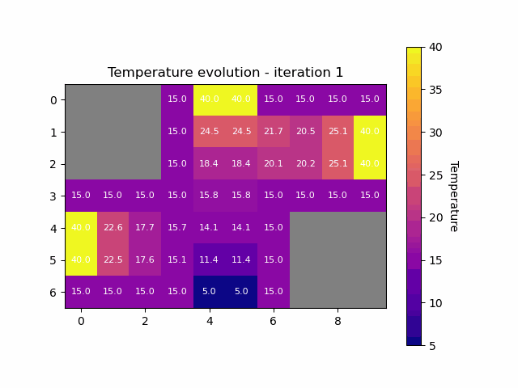
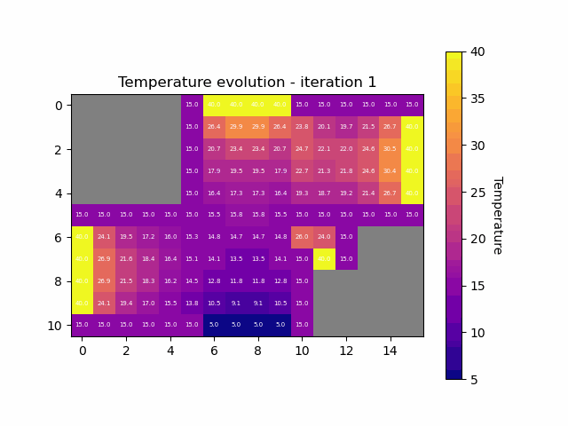
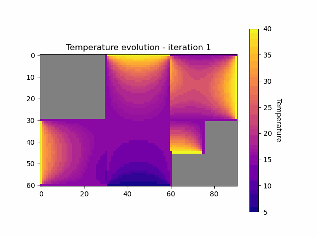

# FMNN25_project3
Parallel numerics and MPI project

# To run the project :

- To run Project 3 (with 3 rooms)
```bash
mpiexec -n 3 python -m fmnn25_project3.main
``` 

- To run Project 3a (with 4 rooms)

```bash
mpiexec -n 4 python -m fmnn25_project3.main --use-room4
``` 

You can change the value of `dx` in the file `main.py` : 
```bash
# ------ Change dx -------
dx = 1 / 20
# ------------------------
``` 
If there is an issue with the librairies you can create a virtual environment :

```bash
python3 -m venv myenv
source myenv/bin/activate
pip install -r requirements.txt
```

And then run the programm

# Project Structure :

```text
FMNN25_project3/
│── fmnn25_project3/            # Main Python package
│   │── __init__.py             # Package initializer
│   │── main.py                 # Entry point for the program
│   │── matrix.py               # Hard-coded A and b matrix for dx = 1/3 (Task 1)
│   │── room.py                 # Room class
│   │── dirichlet_neumann.py    # DirichletNeumannSolverMPi class implementation
│   │── visualization.py        # Visualization functions
│   └── without_mpi.py          # Solving task1 without MPI to understand the problem
│
│── Makefile                     # Build/execute scripts
│── README.md                    # Project documentation
│── animation1.gif               # Example output animation
└── requirements.txt             # Python dependencies
```
# Task 1 :

You can check the matrices that we get within the Dirichlet-Neumann iteration when we choose a mesh width of ∆x = 1/3 in the **matrix.py** file


# Animation : 

## Simulation of 3 rooms for dx = 1/3 :


## Simulation of 3 rooms for dx = 1/20 :


## Simulation of 4 rooms for dx = 1/5 :



## Simulation of 4 rooms for dx = 1/20 :


## Simulation of 4 rooms for dx = 1/30 :




