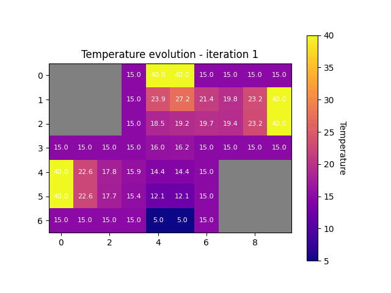

# FMNN25_project3
Parallel numerics and MPI project

# To run the project :

```bash
mpiexec -n 3 python -m fmnn25_project3.main
``` 

If there is an issue with the librairies you can create a virtual environment :

```bash
python3 -m venv myenv
source myenv/bin/activate
pip install -r requirements.txt
```

And then run the programm

# Project Structure :

```text
FMNN25_project3/
│── fmnn25_project3/            # Main Python package
│   │── __init__.py             # Package initializer
│   │── main.py                 # Entry point for the program
│   │── matrix.py               # Hard-coded A and b matrix for dx = 1/3 (Task 1)
│   │── room.py                 # Room class
│   │── dirichlet_neumann.py    # DirichletNeumannSolverMPi class implementation
│   │── visualization.py        # Visualization functions
│   └── without_mpi.py          # Solving task1 without MPI to understand the problem
│
│── Makefile                     # Build/execute scripts
│── README.md                    # Project documentation
│── animation1.gif               # Example output animation
└── requirements.txt             # Python dependencies
```
# Task 1 :

You can check the matrices that we get within the Dirichlet-Neumann iteration when we choose a mesh width of ∆x = 1/3 in the **matrix.py** file


# Animation : 




# Known Issues and Remarks


We encountered many difficulties completing this project and were not able to fully finalize it. Currently, our solution works only for the case (dx = 1/3), with the matrices (A) and (b) hardcoded. We are still working on correcting the way these matrices are computed. The different conventions we used caused confusion and significantly slowed our progress. Nevertheless, we managed to make Project 3 work for this specific case. The extension remains to be implemented: it will require revising how (q_\text{right}) and (q_\text{left}) are calculated, as well as how the border values are added to the final grid.
